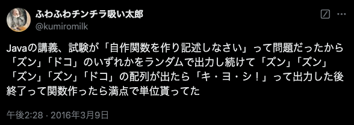
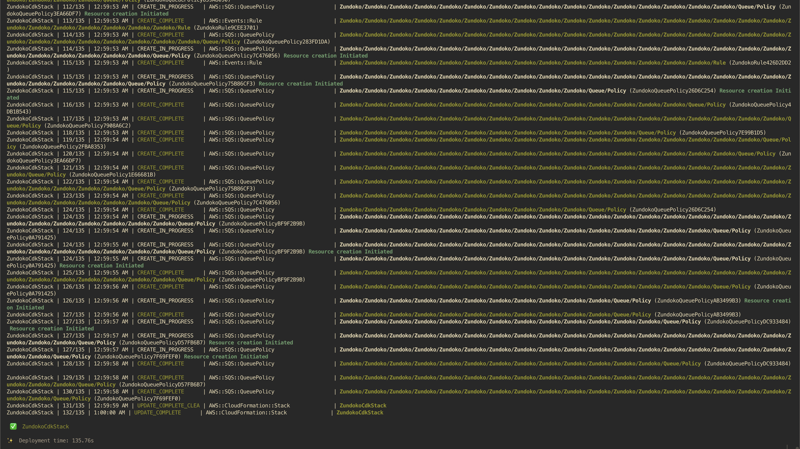
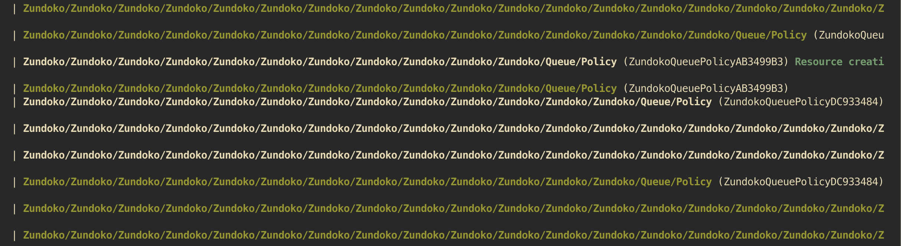

# AWS CDKの真の力を引き出す

やまたつ @jawsug_cdk
2024-12-18

---

<dev style="display: flex; justify-content: center; align-items: center; margin-top: 40px;">
  
  <ul style="list-style-type: none; line-height: 1.4">
    <li style="font-size: 56px; font-weight: 700;">山本達也（やまたつ）</li>
    <li style="font-size: 32px; margin-bottom: 0px;">クラスメソッド株式会社</li>
    <li style="font-size: 32px; margin-bottom: 16px;">製造BT部</li>
    <li style="font-size: 24px; margin-bottom: 0px;">
      <a href="https://twitter.com/yamatatsu193">Twitter: @yamatatsu193</a>
    </li>
    <li style="font-size: 24px; margin-bottom: 16px;">
      <a href="https://github.com/yamatatsu">GitHub: @yamatatsu</a>
    </li>
  </ul>
</dev>

---

AWS CDKはアプリケーションプログラミング言語でインフラを定義できる

---

その特性を最大限に活かしたい！

---

少ない記述で大きな成果を得て大満足したい！

---

再帰

---

ズンドコきよし

---

# AWS CDKの真の力を引き出すためにズンドコきよししてみた

やまたつ @jawsug_cdk
2024-12-18

---

ズンドコきよしのおさらい

---


https://x.com/kumiromilk/status/707437861881180160

---

大ズンドコ時代
https://qiita.com/shunsugai@github/items/971a15461de29563bf90

---

なにをズンドコしよう

---

CDKのくせに毎回実行結果が変わって、そのズンドコ成果が一発で見えて、500リソース制限に引っかかりにくいやつ。。。

---

CloudWatch Dashboards

---

# AWS CDKの真の力を引き出すためにCloudWatch Dashboardsでズンドコしてみた

やまたつ @jawsug_cdk
2024-12-18

---

早速コード全文

---

```ts
import * as cdk from "aws-cdk-lib";
import * as cw from "aws-cdk-lib/aws-cloudwatch";

const app = new cdk.App();
const stack = new cdk.Stack(app, "RecursiveCdkStack");

new cw.Dashboard(stack, "ZundokoDashboard", {
  widgets: [recursiveZundokoWidgets()],
});

function recursiveZundokoWidgets(zundoko = ""): cw.TextWidget[] {
  if (zundoko.endsWith("ずんずんずんずんどこ")) {
    return [new cw.TextWidget({ markdown: `# き・よ・し！！`, width: 4 })];
  }

  const phrase = Math.random() < 0.5 ? "ずん" : "どこ";

  return [
    new cw.TextWidget({ markdown: `${phrase}`, width: 4 }),
    ...recursiveZundokoWidgets(zundoko + phrase),
  ];
}
```

---


---

🎉🎉🎉

---

🤔

---

🤔 これで終わり？

---

🤔 この程度なのか？

---

🤔 俺たちのきよしはこの程度なのか？

---

🤔 まだConstruct Treeをズンドコ掘ってない

---

# AWS CDKの真の力を引き出すためにConstruct Treeをズンドコ掘ってみた

やまたつ @jawsug_cdk
2024-12-18

---

早速コード

---

```ts
const topic = new sns.Topic(stack, "OutputTopic", {});

new chatbot.SlackChannelConfiguration(stack, "SlackChannel", {
  slackChannelConfigurationName: "Zundoko",
  slackWorkspaceId: "XXXXXXXXX",
  slackChannelId: "XXXXXXXXXXX",
  notificationTopics: [topic],
});

new Zundoko(stack, "Zundoko", {
  outputTarget: (phrase) =>
    new targets.SnsTopic(topic, {
      message: events.RuleTargetInput.fromObject({
        version: "1.0",
        source: "custom",
        content: {
          description: phrase,
        },
      }),
    }),
});
```

---

```ts
export class Zundoko extends Construct {
  public readonly eventBus: events.IEventBus;

  constructor(
    scope: Construct,
    id: string,
    props: {
      outputTarget: (phrase: string) => events.IRuleTarget;
      history?: string;
    },
  ) {
    super(scope, id);

    // 後述
  }
}

function randomZundoko(): string {
  return Math.random() < 0.6 ? "ずん" : "どこ";
}
```

---

```ts
const { outputTarget, history = "" } = props;

const last = history.endsWith("ずんずんずんずんどこ");

const phrase = last ? "き・よ・し！！" : randomZundoko();

this.eventBus = new events.EventBus(this, "Bus");
const rule = new events.Rule(this, "Rule", {
  eventBus: this.eventBus,
  eventPattern: { source: events.Match.anyOf(events.Match.prefix("")) },
});
rule.addTarget(outputTarget(phrase));

if (last) {
  return;
}

const { eventBus } = new Zundoko(this, "Zundoko", {
  outputTarget,
  history: history + phrase,
});

const queue = new sqs.Queue(this, "Queue", {
  deliveryDelay: cdk.Duration.seconds(1),
});
rule.addTarget(new targets.SqsQueue(queue));

new pipes.Pipe(this, "Pipe", {
  source: new pipesSources.SqsSource(queue),
  target: new pipesTargets.EventBridgeTarget(eventBus, {
    inputTransformation: pipes.InputTransformation.fromObject({}),
  }),
});
```

---

デプロイ！ 🚀

---

<span style="color: red">Error: Number of resources in stack 'ZundokoCdkStack': 645 is greater than allowed maximum of 500</span>

---



---



---

デモ

---

# まとめ

---

まとめ

- 再帰のシンプルな記述で大きな成果が得られて大満足した
- IaCの「状態が収束する」という概念をぶっ壊せて良かった
- そんなときも「き・よ・し！！」のコールで乗り切ってる感じがして感動した

---

<!-- _class: center -->

ご清聴ありがとうございました :pray:
