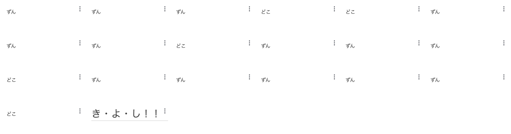

# AWS CDKの真の力を引き出す

やまたつ @jawsug_cdk
2023-12-06

---

<dev style="display: flex; justify-content: center; align-items: center; margin-top: 40px;">
  
  <ul style="list-style-type: none; line-height: 1.4">
    <li style="font-size: 56px; font-weight: 700;">山本達也（やまたつ）</li>
    <li style="font-size: 32px; margin-bottom: 0px;">クラスメソッド株式会社</li>
    <li style="font-size: 32px; margin-bottom: 16px;">CX事業本部 デリバリー部</li>
    <li style="font-size: 24px; margin-bottom: 0px;">
      <a href="https://twitter.com/yamatatsu193">Twitter: @yamatatsu193</a>
    </li>
    <li style="font-size: 24px; margin-bottom: 16px;">
      <a href="https://github.com/yamatatsu">GitHub: @yamatatsu</a>
    </li>
  </ul>
</dev>

---

AWS CDKはアプリケーションプログラミング言語でインフラを定義できる

---

その特性を最大限に活かしたい！

---

少ない記述で大きな成果を得て大満足したい！

---

再帰

---

ドドスコ

---

# AWS CDKの真の力を引き出すためにドドスコしてみた

やまたつ @jawsug_cdk
2023-12-06

---

なにをドドスコしよう

---

CDKのくせに毎回実行結果が変わって、そのドドスコ成果が一発で見えて、500リソース制限に引っかかりにくいやつ。。。

---

CloudWatch Dashboards

---

# AWS CDKの真の力を引き出すためにCloudWatch Dashboardsでドドスコしてみた

やまたつ @jawsug_cdk
2023-12-06

---

早速コード全文

---

```ts
import * as cdk from "aws-cdk-lib";
import * as cw from "aws-cdk-lib/aws-cloudwatch";

const app = new cdk.App();
const stack = new cdk.Stack(app, "RecursiveCdkStack");

new cw.Dashboard(stack, "DodosukoDashboard", {
  widgets: [recursiveDodosukoWidgets()],
});

function recursiveDodosukoWidgets(dodosuko = ""): cw.TextWidget[] {
  if (dodosuko.endsWith("どどすこすこすこ")) {
    return [new cw.TextWidget({ markdown: `# ラブ注入`, width: 4 })];
  }

  const phrase = Math.random() < 0.5 ? "どど" : "すこ";

  return [
    new cw.TextWidget({ markdown: `${phrase}`, width: 4 }),
    ...recursiveDodosukoWidgets(dodosuko + phrase),
  ];
}
```

---



---

# まとめ

---

まとめ

- 再帰のシンプルな記述で大きな成果が得られて大満足した
- IaCの「結果が収束する」という概念をぶっ壊せて良かった
- そんなときも「愛（ラブ）」で乗り切ってる感じがして感動した

---

<!-- _class: center -->

ご清聴ありがとうございました :pray:
